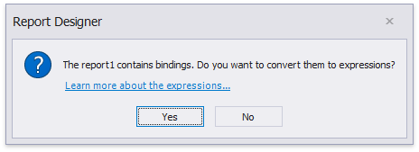
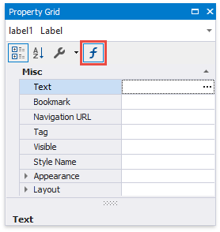
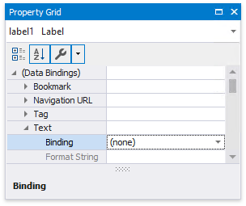
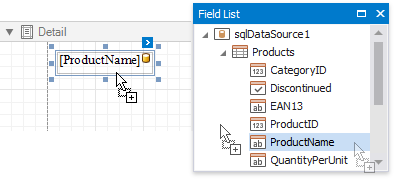
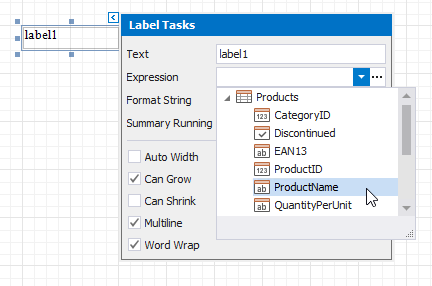
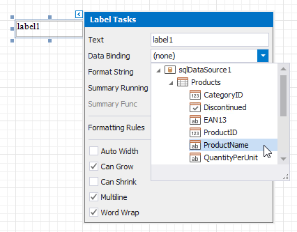
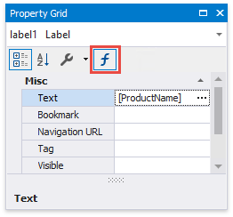
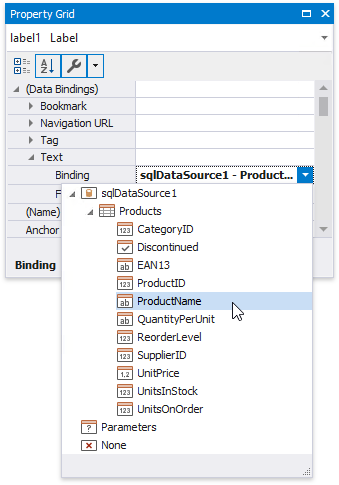
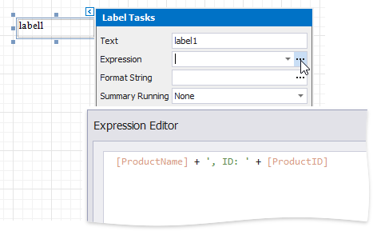
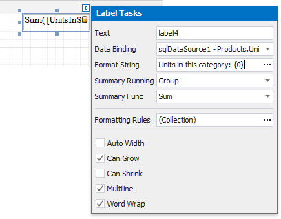

# Data Binding Modes

## Conversion Dialog

The following dialog can appear when **expression bindings** are enabled in the Report Designer and you [open an existing report](../open-reports.md) that uses standard **data bindings**:

This dialog prompts you to to convert your report to use expressions (the new binding mechanism). Click **Yes** to run the report conversion, click **No** to open the report without changes.

If this dialog does not appear, check which binding mode the Report Designer uses.

## Data Binding Modes

* **Expression Bindings**

    Enable you to use complex [expressions](../use-expressions.md) that include two or more fields and various functions. Expressions also allow you to calculate complex summaries without scripts and conditionally shape your data without formatting rules.

    This mode is enabled in the Report Designer if the [Property Grid](../report-designer-tools/ui-panels/property-grid.md) provides the **Expressions**  tab.

    

* **Data Bindings**

    Enable you to assign a single data field to a report control or use [report scripts](../use-report-scripts.md) in complex scenarios.

    This mode is enabled in the Report Designer if the [Property Grid](../report-designer-tools/ui-panels/property-grid.md) does not provide the **Expressions**  tab.

    

## Binding Mode Comparison

### **Bind to a Single Data Field**

* The [Field List](../report-designer-tools/ui-panels/field-list.md) panel allows you to drop fields onto the design surface or existing report controls. All binding ways are identical in the **data bindings** and **expression bindings** modes. 

    

* The control's smart tag enables you to select the target data field in the corresponding drop-down list.

    | Expression Bindings | Data Bindings |
    |---|---|
    |  |  |

* You can select a report control and bind it to data in the [Property Grid](../report-designer-tools/ui-panels/property-grid.md).

    | Expression Bindings | Data Bindings |
    |---|---|
    | Switch to the **Expressions** tab and click the the **Text** property's ellipsis button. In the invoked **Expression Editor**, select a data field. | Expand the **(Data Bindings)** category and assign a data field to the **Text** property. |
    | |  |

    <table><tr><th>
Expression Bindings

    </th><th>
Data Bindings

    </th></tr><tr><td>
Switch to the <strong>Expressions</strong> tab and click the the <strong>Text</strong> property's ellipsis button. In the invoked <strong>Expression Editor</strong>, select a data field.

    

    </td><td>
Expand the <strong>(Data Bindings)</strong> category and assign a data field to the <strong>Text</strong> property.

    

    </td>
    </tr</table>

See the following topics for more information:

* [Bind Report Controls to Data (Expression Bindings)](bind-controls-to-data-expression-bindings)
* [Bind Report Controls to Data (Data Bindings)](bind-controls-to-data-data-bindings)

### **Bind to Multiple Data Fields**

| Expression Bindings | Data Bindings |
|---|---|
| Use the [mail merge]() functionality. | Use the [mail merge]() functionality. |
| | 
| Click the **Expression** property's ellipsis button and specify the expression. | |
| | 

### **Calculate Summary**

Click the label's smart tag and set the **Summary Running** property to the range for which to calculate a summary. 

| Expression Bindings | Data Bindings |
|---|---|
| Click the **Expression** property's ellipsis button and, in the invoked **Summary Expression Editor**, select the summary function in the **Summary** section. | Set the **Summary Func** property to the required summary function.
| | 

### **Complex Binding, Custom Summary**

### **Customize Appearance**