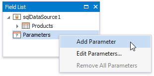
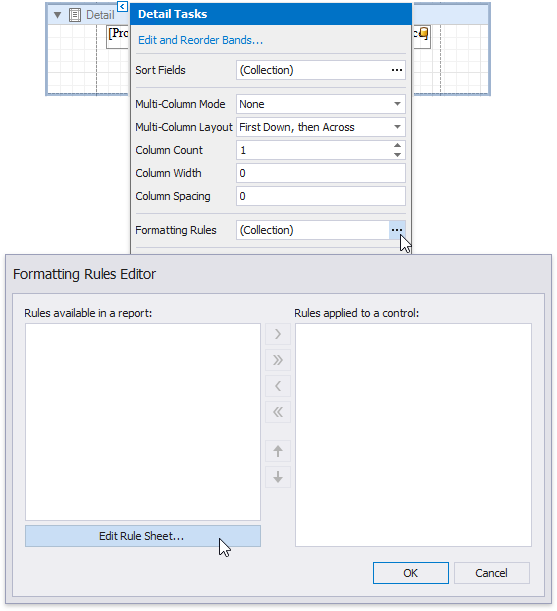
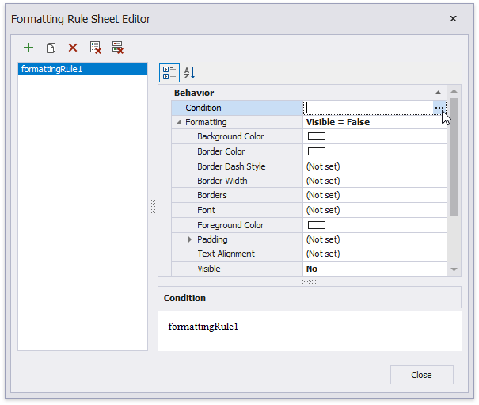
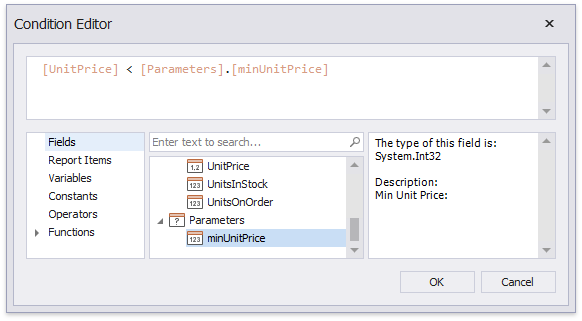

# Conditionally Filter Report Data

This document describes how to filter a report's data based on a specific condition.

> [!Warning]
> Use the approach below if expression bindings **are not enabled** in the Report Designer (the [Property Grid](../../report-designer-tools/ui-panels/property-grid.md) does not provide the **Expressions**  tab ).
>
> See [Conditionally Filter Report Data](../shape-data-expression-bindings/conditionally-filter-report-data.md) if expression bindings **are enabled** in the Report Designer (the [Property Grid](../../report-designer-tools/ui-panels/property-grid.md) provides the **Expressions**  tab).

1. Switch to the [Field List](../../report-designer-tools/ui-panels/field-list.md), right-click the **Parameters** section and add a new report parameter.
	
	

2. Specify the parameter's description in Print Preview and set its type to **Number (Integer)**.
	
	

3. Click the Detail band's smart tag, and in its actions list, click the **Formatting Rules** property's ellipsis button. In the invoked **Formatting Rules Editor**, click the **Edit Rule Sheet** button.

	

4. In the invoked **Formatting Rule Sheet Editor**, click the plus button to create a new formatting rule. Set the **Visible** property to **False** and click the **Condition** property's ellipsis button.

	

5. In the invoked **Condition Editor**, specify the required visibility condition.
	
	
	

	Click **OK** to save the changes and close the dialog. Then, click **Close** to quit the **Formatting Rule Sheet Editor**.

6. In the **Formatting Rules Editor**, you can see the created rule (called **formattingRule1**), which should be moved to the list of active rules on the right using the arrow buttons in the center of the dialog box.

	

	In this editor, you can also customize the precedence of formatting rules using the up and down arrow buttons on the right of the dialog box. The rules are applied in the same order that they appear in the list, and the last rule in the list has the highest priority.

Switch to [Print Preview](../../preview-print-and-export-reports.md) to see the result. 

