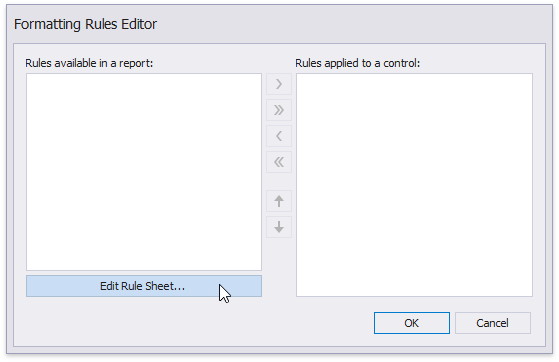
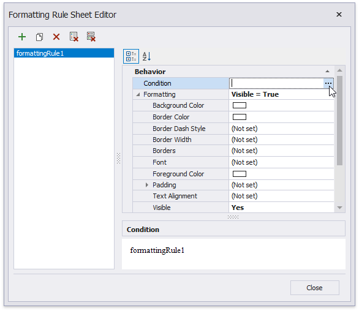
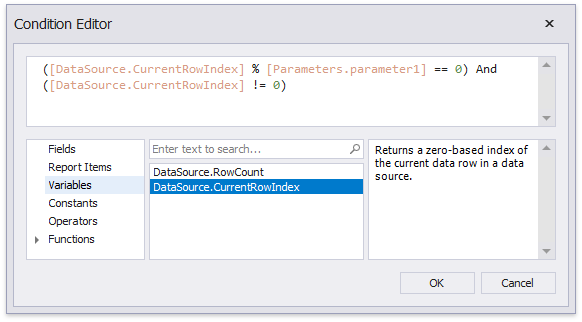

# Limit the Number of Records per Page

This document describes how to specify the number of data source records displayed on report pages.

> [!Warning]
> Use the approach below if expression bindings **are not enabled** in the Report Designer (the [Property Grid](../../report-designer-tools/ui-panels/property-grid.md) does not provide the **Expressions**  tab ).
>
> See [Limit the Number of Records per Page](../shape-data-expression-bindings/limit-the-number-of-records-per-page.md) if expression bindings **are enabled** in the Report Designer (the [Property Grid](../../report-designer-tools/ui-panels/property-grid.md) provides the **Expressions**  tab).

After you [bound your report to data](../../bind-to-data.md) and provided content to the report's [Detail band](../../introduction-to-banded-reports.md), you can limit the number of records each report page displays. This example demonstrates how to pass the required record count as a parameter value.

 1. Switch to the [Field List](../../report-designer-tools/ui-panels/field-list.md), right-click the **Parameters** section and add a new report parameter..
	
	

2. Specify the parameter's description displayed in Print Preview and set its type to **Number (Integer)**.
	
	

3. Drop a [Page Break](../../use-report-elements/use-basic-report-controls/page-break.md) control onto the report's Detail band. Set the control's **Visible** property to **No** and click the **Formatting Rules** property's ellipsis button.

    

4. In the invoked **Formatting Rules Editor**, click the **Edit Rule Sheet** button.

    

5. In the invoked **Formatting Rule Sheet Editor**, click the plus button to create a new formatting rule. Set the **Visible** property to **Yes** and click the **Condition** property's ellipsis button.

	

6. In the invoked **Condition Editor**, specify the required expression.
	
	
	
	For example:
	
	**([DataSource.CurrentRowIndex] % [Parameters.parameter1] == 0) And ([DataSource.CurrentRowIndex] !=0)**

    Click **OK**, to save the changes and close the dialog. Then, click **Close** to quit the **Formatting Rule Sheet Editor**.

7. In the **Formatting Rules Editor**, you can see the created rule (called **formattingRule1**), which should be moved to the list of active rules on the right using the arrow buttons in the center of the dialog box.

	

When switching to [Print Preview](../../preview-print-and-export-reports.md), you can specify how many rows each report page should display by entering the corresponding parameter value:

