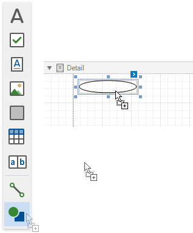
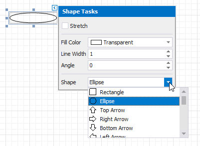
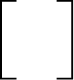
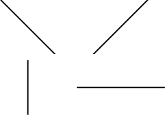

# Draw Shapes

The **Shape** control allows you to draw various shapes in a report.

To add a shape to a report, drag the **Shape** item from the [Toolbox](../../report-designer-tools/toolbox.md) onto the report's area.

Click a control's smart tag and use the **Shape** property to select a required shape type. You can also choose the shape type in the [Toolbar](../../report-designer-tools/toolbar.md)'s  **Shape Tools** contextual tab.

The smart tag provides the following main properties common for all shape types:

* **Fill Color** - specifies the color to fill the shape.
* **Stretch** - specifies whether to stretch a shape to fill its client rectangle area when it is rotated.
* **Line Width** - specifies the line width to draw the shape image.
* **Angle** - specifies the angle by which the shape image is rotated.

Each shape type provides its own specific set of properties which are detailed below.

## Arrow
A shape of the **Arrow** type looks as shown in the image below.

This shape type features the following additional properties:  

* **Fillet** - specifies how shape corners are rounded (in percent). This value should be from **0** to **100**.
* **Arrow Height** - specifies the relative arrow height (in percent). This value should be from **0** to **100**.
* **Arrow Width** - specifies the relative arrow height (in percent). This value should be from **0** to **100**.
 

## Brace
The image below illustrates a shape of the **Brace** type.

Use the following properties to setup a particular brace:

* **Tip's Length** -  specify the length of a brace's tip.
* **Fillet** - specifies how shape corners are rounded (in percent). This value should be from **0** to **100**.
* **Tail's Length** specify the length of a brace's tail.

## Bracket

The following image demonstrates a shape of the **Bracket** type.

The **Tip's Length** property is specific to this shape type and defines the length of a bracket's tip.

## Cross

A shape of the **Cross** type looks as shown in the image below.

This shape type provides the following properties:

* **Fillet** - specifies how shape corners are rounded (in percent). This value should be from **0** to **100**.
* **Horizontal Line Height** - specifies the relative width of a cross's horizontal line (in percent). This value should be from **0** to **100**.
* **Vertical Line Width** - specifies the relative width of a cross's vertical line (in percent). This value should be from **0** to **100**.

## Ellipse

The image below shows shapes of the **Ellipse** type.

## Line

The following image demonstrates various shapes of the **Line** type.

## Polygon

A shape of the **Polygon** type looks as follows:

You can use the following properties specific for this shape type:

* **Fillet** - specifies how polygon corners are rounded (in percent). This value should be from **0** to **100**.
* **Number Of Sides** - specifies the number of polygon sides.

## Rectangle

The image below illustrates shapes of the **Rectangle** type.

This shape type provides the **Fillet** property that specifies the rectangle's relative roundness (in percent, from **0** to **100**). 

## Star

A shape of the **Star** type looks as shown in the image below.

This shape type supports the following properties:

* **Fillet** - specifies the relative roundness of the star's points (in percent). This value should be from **0** to **100**.
* **Count of Star Points** - specifies the number of points in the star.
* **Concavity** - specifies the concavity level (in percent) between two neighboring start points. This value should be from **0** to **100**.