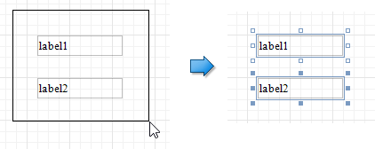
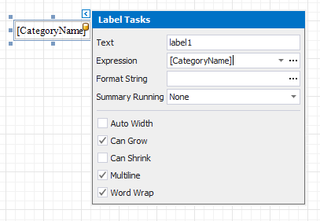
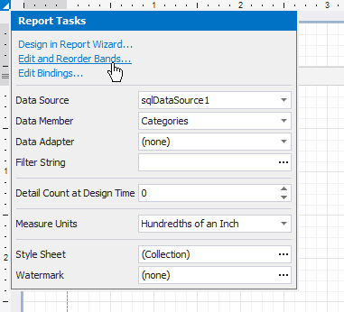
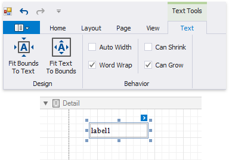
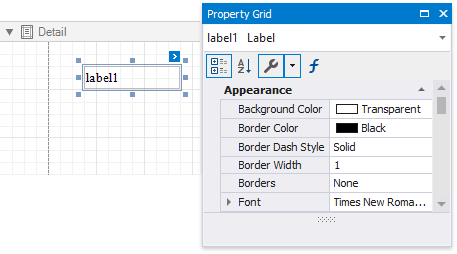

# Select Report Elements and Access Their Settings

Click a report control or band to select it. Press TAB/SHIFT+TAB to select the next/previous control in tab order. 

Do one of the following to select multiple report controls:
* Press and hold the SHIFT or CTRL key and click the required controls.
* Click an empty place on a report's surface and draw a rectangle around the required controls.
    

Click a gray area around the design surface to select a report.

You can use smart tags to access the most commonly used element properties. Smart tags are available for most report controls, bands and a report itself.

Smart tags can also contain context links that enable you to perform various actions.

When you select a report control of specific type, the [Toolbox](../../report-designer-tools/toolbox.md) provides the corresponding contextual tab. This tab allows you to specify settings and perform actions applicable to the selected element's type.

You can use the Property Grid to access the whole set of settings that the selected element supports.

