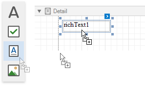
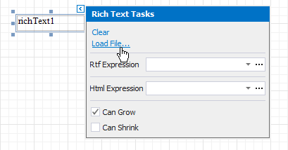
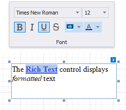
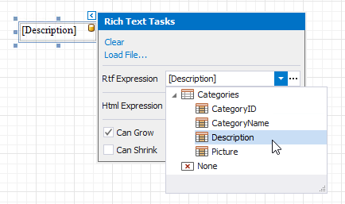
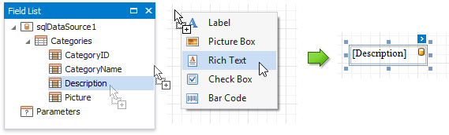

# Rich Text

## Overview
The **Rich Text** control displays formatted text (static, dynamic or mixed) in your report.

To add this control to a report, drag the **Rich Text** item from the [Toolbox](../../report-designer-tools/toolbox.md) onto the report's area.

You can load RTF or HTML content for the Rich Text control from an external file. Click the control's smart tag and select **Load File**.

In the invoked **Open** dialog, use the drop-down list to define the file's extension (**.rtf**, **.docx**, **.txt**, **.htm** or **.html**), select the file and click **Open**.

You can double-click the Rich Text to invoke its in-place editor and enter the desired static text. Use the [Toolbar](../../report-designer-tools/toolbar.md)'s **Font** group to format any text part. 

Press CTRL+Enter to submit text changes and exit the in-place editor.

> [!NOTE]
> When exporting to XLS or XLSX format, the Rich Text's content is exported as plain text only.

## Bind to Data

You can [bind](../../bind-to-data/bind-controls-to-data-expression-bindings.md) the control's **RTF** property to a data field obtained from a report's data source. Click the control's smart tag, expand the **Rtf Expression** drop-down list and select the required data field.
 

In the same way, you can bind the control to a data field that provides HTML content. To do this, click the control's smart tag and use the **Html Expression** drop-down list.

Clicking the **Rtf Expression** or **Html Expression** option's ellipsis button invokes the **Expression Editor**, in which you can construct a complex binding expression with two or more data fields. 

You can also drag and drop any field from the [Field List](../../report-designer-tools/ui-panels/field-list.md) with the right mouse button and select the **Rich Text** menu item. This creates a new Rich Text control bound to this field.

The Rich Text also enables you to merge data fields and static content in its text. 

See the [Bind Controls to Data](../../bind-to-data/bind-controls-to-data-expression-bindings.md) and [Use Embedded Fields](../../bind-to-data/use-embedded-fields-mail-merge.md) topics to learn more.