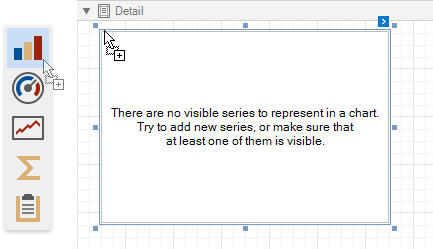
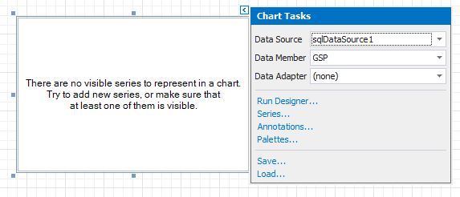
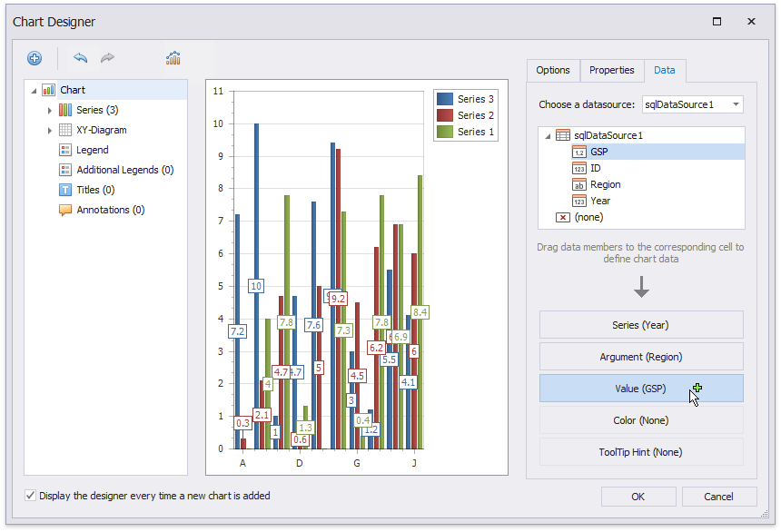
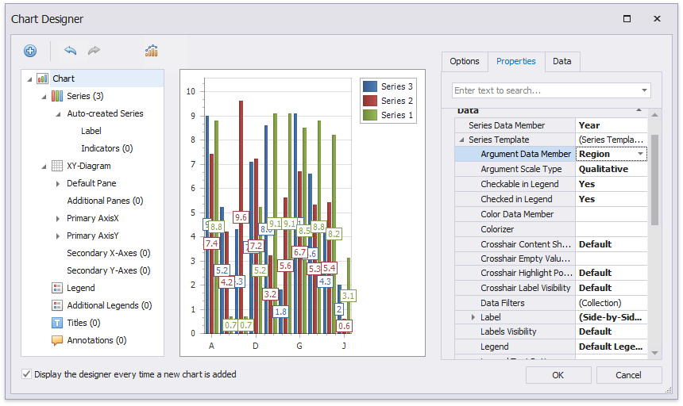
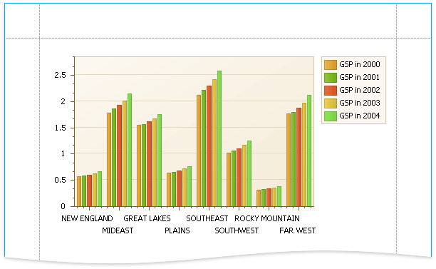

# Add a Chart (Use a Series Template)

This document describes how to create a report with a **Chart** control bound to data, so that all series are created automatically based on a common template.

## Add a Chart to a Report

1. Drop the **Chart** control from the [Toolbox](../../report-designer-tools/toolbox.md) onto the [Detail band](../../introduction-to-banded-reports.md).

    

    After you drop the chart, the **Chart Designer** is automatically invoked if its **Display the designer every time a new chart is added** option is enabled. Close the designer at this step.

2. Open the [Toolbar](../../report-designer-tools/toolbar.md)'s **Chart Tools** contextual tab and click the **Add Data Source** button to bind the chart to data. 

    

3. The invoked [Data Source Wizard](../../report-designer-tools/data-source-wizard.md) enables you to assign a data source to the chart. Bind the chart to the required data source as described in the [Bind to Data](../../bind-to-data.md) section.

4. Click the chart's smart tag and make sure that the **Data Source** and **Data Member** properties were correctly automatically specified.
	
	

> [!NOTE]
> The report's **Data Source** property should be set to **None** since you placed the Chart in the Detail band. When a report has its **Data Source** property specified, the Chart is repeated in preview as many times as there are records in the report data source.

## Adjust the Series Template

1. Switch to the **Chart Tools** toolbar tab and click the **Run Designer** button.

    

2. In the invoked **Chart Designer**, go to the **Data** tab to the right of the designer's window. Select an existing data source in the corresponding drop-down list and drag-and-drop the required data fields to the corresponding cells.
	
	The **Series** cell specifies a data field that should provide data for series names. A new series should be created for each record in this data field. Use the **Argument** and **Value** cells to define where to get data for point arguments and values.

    

3. Switch to the **Properties** tab and expand the **Series Template** option. As you can see, the **Argument Data Member** and **Value Data Members** properties are automatically assigned to the corresponding data fields. Make sure that the **Argument Scale Type** and **Value Scale Type** properties are set to appropriate values.

    

## Customize the Chart
Perform the following customization to improve the chart's appearance:

* Use the chart's **Series Name Template** property to add text to the beginning or end of each series name. For example, set the **Begin Text** inner property to "GSP in ".
* Set the **Labels Visibility** property to **False** to avoid overlapping series labels. 
* Specify the color settings used to draw the chart's series. For instance, select **Nature Colors** in the **Palette** drop-down list.

## View the Result
Switch to [Print Preview](../../preview-print-and-export-reports.md) to see the resulting report.

